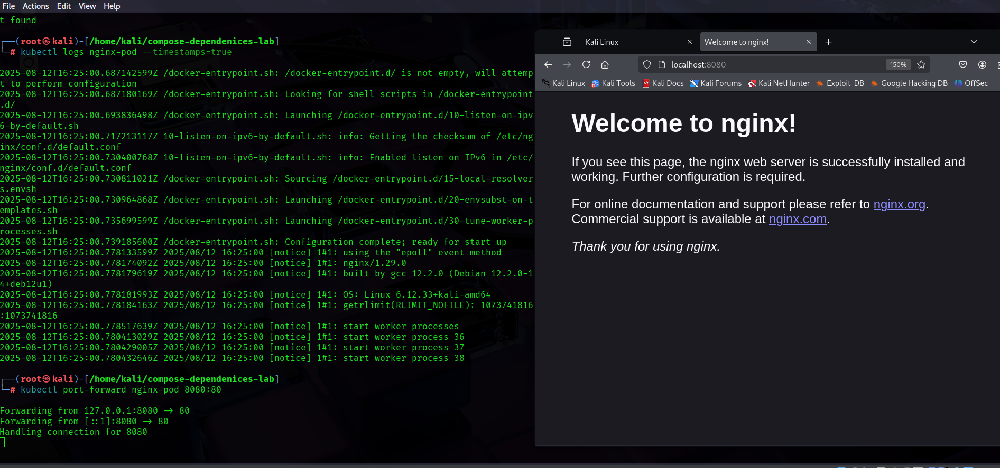

# Lab 18: Kubernetes Pod Deployment
## 🎯 Objectives

By the end of this lab, you will be able to:

- Understand the structure of a Kubernetes Pod YAML manifest.

- Deploy a basic Pod on Kubernetes or OpenShift.

- Inspect Pod status and logs for troubleshooting.

## 📌 Prerequisites

- A working Kubernetes/OpenShift cluster (Minikube, Kind, or OpenShift Local).

- kubectl (or oc) installed + configured.

- Basic understanding of YAML syntax.

---

# 🛠️ Task 1: Write a Pod YAML Manifest
 
## Subtask 1.1: Create a Pod Manifest File

Open a text editor:
```
nano simple-pod.yaml
```
Paste this content:

yaml
```
apiVersion: v1
kind: Pod
metadata:
  name: nginx-pod
  labels:
    app: nginx
spec:
  containers:
  - name: nginx-container
    image: nginx:latest
    ports:
    - containerPort: 80
```

## 🔎 Explanation:

- apiVersion: Kubernetes API version (v1 for Pod).

- kind: Resource type (Pod).

- metadata: Pod’s name + labels.

- spec: Defines container details (image, ports, etc.).

✅ Expected: A valid YAML defining an Nginx Pod.

---

# 🛠️ Task 2: Deploy the Pod
## Subtask 2.1: Apply the YAML File
```
kubectl apply -f simple-pod.yaml
```
Expected Output:
```
pod/nginx-pod created
```
## Subtask 2.2: Verify Pod Deployment
```
kubectl get pods
```
Expected:
```
sql

NAME        READY   STATUS    RESTARTS   AGE
nginx-pod   1/1     Running   0          10s
```

## ⚠️ Troubleshooting:

- Pod Pending → check details:
```
kubectl describe pod nginx-pod
```
- Pod CrashLoopBackOff → inspect logs:

```
kubectl logs nginx-pod
```

# Hands-On Expected Output:


---

# 🛠️ Task 3: Inspect Pod Status and Logs
## Subtask 3.1: Check Pod Details
```
kubectl describe pod nginx-pod
```
Shows Pod events, IP, node, and container status.

## Subtask 3.2: View Pod Logs
```
kubectl logs nginx-pod
```
# Hands-On Expected Output:


Shows Nginx logs.

## Subtask 3.3: Access the Pod (Optional)

Forward Pod port → local machine:

```
kubectl port-forward nginx-pod 8080:80
```
- Open in browser:

👉 http://localhost:8080

You’ll see the Nginx welcome page.

# Hands-On Expected Output:




---

# 🏁 Conclusion

In this lab, you:

- Created a Pod YAML manifest.

- Deployed a Pod with kubectl apply.

- Verified Pod health + checked logs.

- (Optional) Exposed Pod locally.

---

## 🚀 Next Steps

- Try multi-container Pods.

- Explore lifecycle features (restartPolicy, probes).

- Deploy Pods with ConfigMaps/Secrets.

---

## 📚Additional Resources

Kubernetes Pod Documentation: https://kubernetes.io/docs/concepts/workloads/pods/

OpenShift Pod Management: https://docs.openshift.com/en

## End of Lab 🚀
